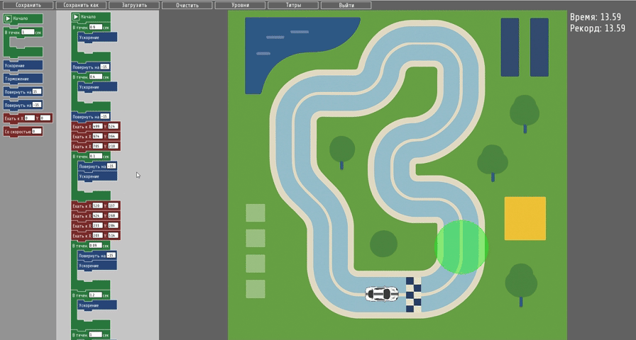

Block Race — это игровое приложение, разработанное на языке C++ с использованием библиотеки SFML в
рамках курсового проекта. Проект представляет собой головоломку, где игрок управляет автомобилем, 
составляя алгоритмы из визуальных блоков (ускорение, поворот, движение к точке и др.). Игра сочетает 
элементы программирования и гонок, предоставляя интуитивно понятный интерфейс для создания и выполнения команд.

---

Ключевые особенности:
Визуальное программирование: игрок использует блоки (ускорение, поворот, движение к точке и др.) 
для создания алгоритмов.

- Игровая механика: реалистичная физика движения автомобиля, система коллизий и чекпоинтов.

- Редактор уровней: загрузка уровней из JSON-файлов, сохранение прогресса.

- Интуитивный интерфейс: поддержка drag-and-drop для блоков, визуальные подсказки.

--- 

Технологии:
- Язык: C++ (стандарт C++ 17)

- Библиотеки: SFML 2.5+

- Паттерны: ООП, Наблюдатель (EventBus)